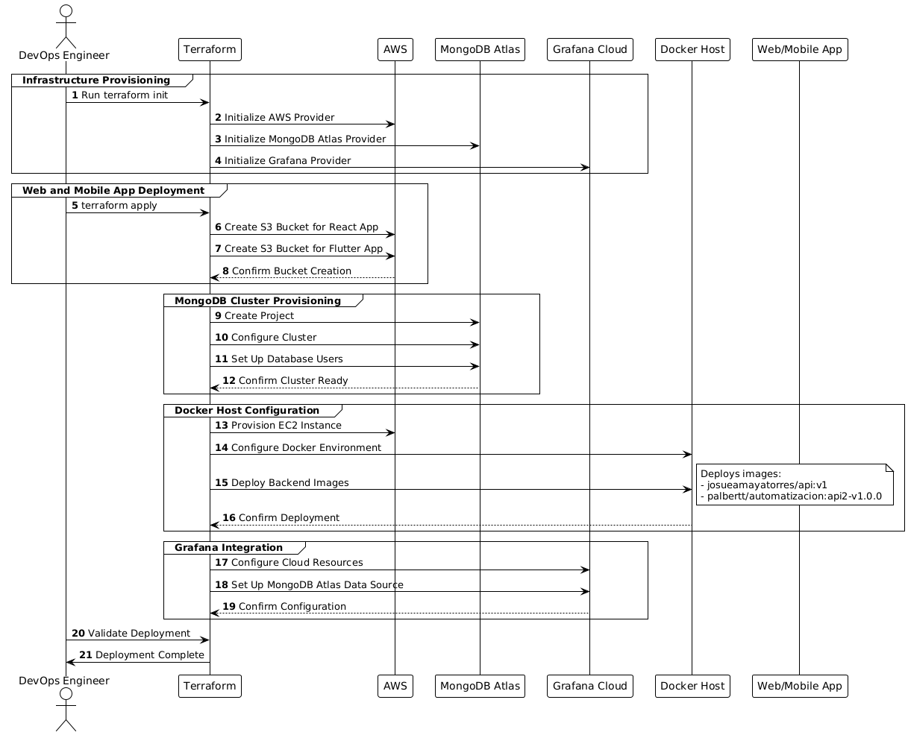
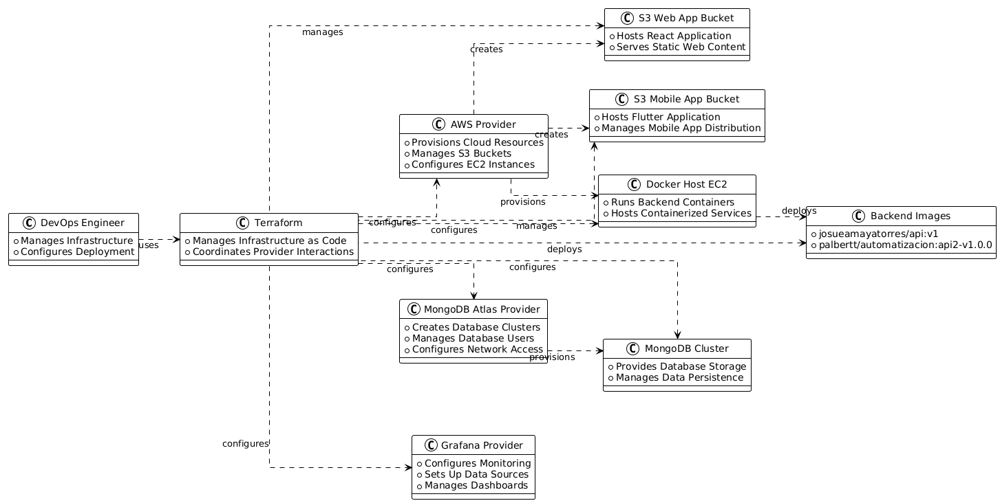
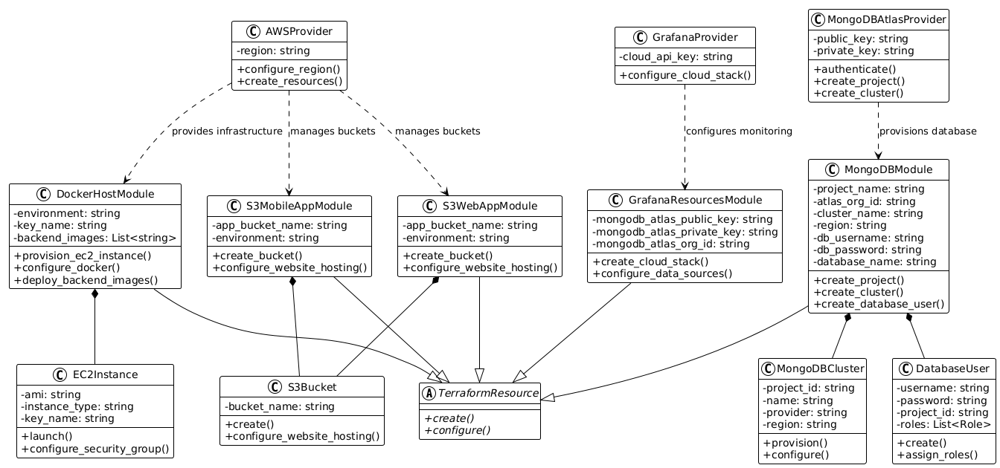
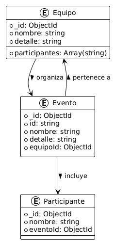
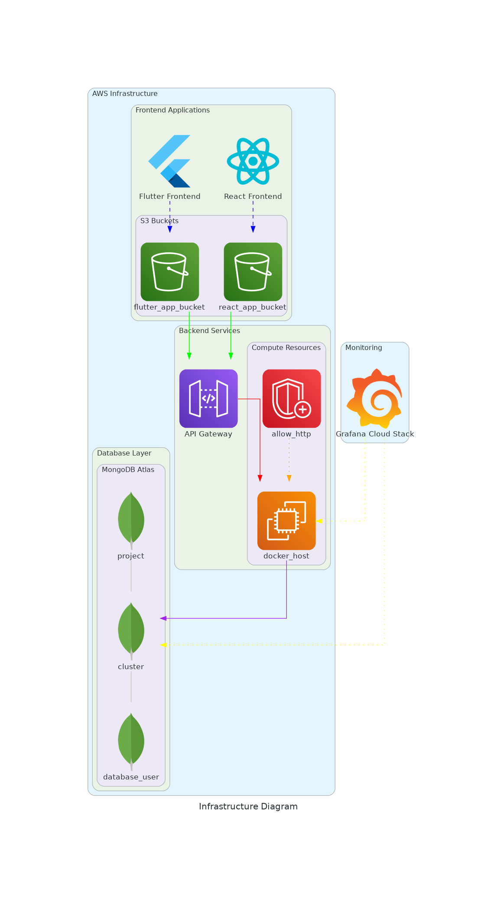

[comment]: 

**UNIVERSIDAD PRIVADA DE TACNA**

**FACULTAD DE INGENIERIA**

**Escuela Profesional de Ingeniería de Sistemas**

**Proyecto *"Infraestructura Tecnológica para el Evento Juegos Florales de la Universidad Privada de Tacna"***

Curso: *Tópicos de Base de Datos Avanzados*

Docente: *Mag. Patrick Cuadros Quiroga*

Integrantes:

***Apaza Ccalle, Albert Kenyi (2021071075)***

***Huallpa Maron, Jesús Antonio (2021071085)***

***Helbert Andres Condori Loayza (2020067571)***

**Tacna – Perú**

***2024***

**  
**

<table style="width: 100%; border: none;">
<tr>
    <td style="text-align: left; vertical-align: top;">
        
    </td>
    <td style="text-align: right; vertical-align: top;">
        
    </td>
</tr>
</table>

\pagebreak

|CONTROL DE VERSIONES||||||
| :-: | :- | :- | :- | :- | :- |
|Versión|Hecha por|Revisada por|Aprobada por|Fecha|Motivo|
|1\.0|MPV|ELV|ARV|10/10/2020|Versión Original|

**Sistema *"Infraestructura Tecnológica para el Evento Juegos Florales de la Universidad Privada de Tacna"***

**Documento de Arquitectura de Software**

**Versión *{1.0}***
**

\pagebreak

|CONTROL DE VERSIONES||||||
| :-: | :- | :- | :- | :- | :- |
|Versión|Hecha por|Revisada por|Aprobada por|Fecha|Motivo|
|1\.0|MPV|ELV|ARV|10/10/2020|Versión Original|

\pagebreak

**INDICE GENERAL**
#
[1.	INTRODUCCIÓN](#_Toc52661346)

1.1	Propósito (Diagrama 4+1)

1.2	Alcance

1.3	Definición, siglas y abreviaturas

1.4	Organización del documento

[2.	OBJETIVOS Y RESTRICCIONES ARQUITECTONICAS](#_Toc52661347)

2.1	Requerimientos Funcionales

2.2	Requerimientos No Funcionales – Atributos de Calidad

[3.	REPRESENTACIÓN DE LA ARQUITECTURA DEL SISTEMA](#_Toc52661348)

3.1.	Vista de Caso de uso	

3.1.1.	Diagramas de Casos de uso

3.2.	Vista Lógica	

3.2.1.	Diagrama de Subsistemas (paquetes)	

3.2.2.	Diagrama de Secuencia (vista de diseño)	

3.2.3.	Diagrama de Colaboración (vista de diseño)	

3.2.4.	Diagrama de Objetos	

3.2.5.	Diagrama de Clases	

3.2.6.	Diagrama de Base de datos (relacional o no relacional)	

3.3.	Vista de Implementación (vista de desarrollo)	

3.3.1.	Diagrama de arquitectura software (paquetes)	

3.3.2.	Diagrama de arquitectura del sistema (Diagrama de componentes)	

3.4.	Vista de procesos	

3.4.1.	Diagrama de Procesos del sistema (diagrama de actividad)	

3.5.	Vista de Despliegue (vista física)	

3.5.1.	Diagrama de despliegue	

[4.	ATRIBUTOS DE CALIDAD DEL SOFTWARE](#_Toc52661349)

Escenario de Funcionalidad	

Escenario de Usabilidad	

Escenario de confiabilidad	

Escenario de rendimiento	

Escenario de mantenibilidad	

Otros Escenarios	

\pagebreak

**<u>Informe Especificacion Requerimientos</u>**

[1.	INTRODUCCIÓN](#_Toc52661346)

---

### **1.1 Propósito (Diagrama 4+1)**

El propósito del proyecto *"Infraestructura Tecnológica para el Evento Juegos Florales de la Universidad Privada de Tacna"* es diseñar e implementar una infraestructura tecnológica avanzada utilizando el modelo arquitectónico **4+1**, que permita gestionar eficientemente los procesos asociados al evento. Este enfoque contempla las siguientes vistas:  
- **Vista Lógica**: Representación de la interacción entre componentes de software, tales como aplicaciones web, bases de datos y sistemas de monitoreo.  
- **Vista de Desarrollo**: Diseño de los módulos que permitirán implementar y mantener el sistema, destacando herramientas como Terraform, AWS y MongoDB Atlas.  
- **Vista de Procesos**: Detalle del flujo de trabajo y sincronización entre los servicios de computación, almacenamiento y análisis en tiempo real.  
- **Vista Física**: Especificación de los recursos físicos y virtuales que soportarán el sistema, tales como servidores EC2 y almacenamiento S3.  
- **Casos de Uso**: Descripción de los escenarios prácticos que la infraestructura abordará, incluyendo inscripción de participantes, monitoreo del evento y generación de reportes en tiempo real.

---

### **1.2 Alcance**

El alcance del proyecto incluye la planificación, implementación y gestión de una infraestructura escalable que cumpla con los requisitos del evento Juegos Florales.  
- **Ámbito del proyecto**:  
  - Gestión integral de aplicaciones web y móviles para la interacción de participantes y organizadores.  
  - Implementación de sistemas de monitoreo y análisis para garantizar el rendimiento en tiempo real.  
  - Automatización del despliegue y mantenimiento mediante herramientas como Terraform.  

- **Resultados esperados**:  
  - Reducción de tiempos de configuración y gestión de la infraestructura.  
  - Mejora en la experiencia de los usuarios gracias a una plataforma robusta y accesible.  
  - Capacidad de escalabilidad para soportar un incremento en la demanda durante el evento.  

---

### **1.3 Definiciones, Siglas y Abreviaturas**

- **AWS**: Amazon Web Services, proveedor de servicios en la nube.  
- **Terraform**: Herramienta para la automatización de infraestructura como código (IaC).  
- **MongoDB Atlas**: Plataforma en la nube para bases de datos NoSQL gestionadas.  
- **Grafana**: Herramienta de monitoreo y visualización de datos en tiempo real.  
- **EC2**: Servicio de cómputo elástico de AWS para ejecutar máquinas virtuales.  
- **S3**: Servicio de almacenamiento de objetos en la nube de AWS.  

---

### **1.4 Organización del Documento**

El documento está organizado en las siguientes secciones:  
- **Introducción**: Expone los objetivos, alcance y visión general del proyecto.  
- **Posicionamiento**: Describe la oportunidad de negocio y los problemas a resolver.  
- **Descripción de los Interesados y Usuarios**: Define los perfiles y necesidades de los grupos involucrados.  
- **Vista General del Producto**: Expone las capacidades y perspectivas del sistema.  
- **Características del Producto**: Detalla las funcionalidades principales de la infraestructura.  
- **Restricciones y Requisitos Adicionales**: Especifica limitaciones técnicas y normativas.  
- **Conclusiones y Recomendaciones**: Resumen de los resultados esperados y pasos futuros.  

--- 

### 2. Objetivos y Restricciones Arquitectónicas  

### 2.1 Requerimientos Funcionales  

| **ID**  | **Nombre del Requerimiento**                                           | **Descripción**                                                                                                     | **Prioridad** |
|---------|-----------------------------------------------------------------------|---------------------------------------------------------------------------------------------------------------------|---------------|
| RF-01   | Monitoreo de Infraestructura                                           | Monitorear el estado de la infraestructura tecnológica (servidores, red, almacenamiento, etc.) en tiempo real.       | Alta          |
| RF-02   | Despliegue Automático con Terraform                                    | Configurar y desplegar automáticamente los recursos tecnológicos mediante herramientas de automatización (Terraform). | Alta          |
| RF-03   | Garantía de Disponibilidad y Escalabilidad en AWS                      | Garantizar la disponibilidad y escalabilidad de la infraestructura mediante el uso de servicios en la nube (AWS).   | Alta          |
| RF-04   | Pruebas de Carga y Rendimiento                                         | Realizar pruebas de carga y rendimiento de la infraestructura para asegurar la capacidad durante el evento.         | Alta          |
| RF-05   | Integración con Plataformas Universitarias                             | Configurar el sistema de infraestructura para que pueda integrarse con otras plataformas de la universidad, como la gestión de eventos y bases de datos de usuarios. | Media         |
| RF-06   | Implementación de EC2 con Amazon Linux 2 para Docker                   | Implementación de un EC2 con Amazon Linux 2 para la Ejecución de Contenedores Docker en AWS mediante Terraform.     | Alta          |
| RF-07   | Configuración de Instancia de Grafana Cloud                            | Configuración de una Instancia de Grafana Cloud mediante Terraform.                                                | Alta          |
| RF-08   | Hospedaje de Aplicación Flutter en S3                                 | Configuración de un Bucket S3 para Hospedar una Aplicación Flutter como Sitio Web Estático.                        | Media         |
| RF-09   | Configuración de MongoDB Atlas                                        | Configuración de un Cluster y Usuario de MongoDB Atlas mediante Terraform.                                         | Alta          |
| RF-10   | Hospedaje de Aplicación React en S3                                   | Configuración de un Bucket S3 para Hospedar una Aplicación React como Sitio Web Estático.                          | Media         |

---

### 2.2 Requerimientos No Funcionales – Atributos de Calidad  

| **ID**  | **Nombre del Requerimiento**                                           | **Descripción**                                                                                                     | **Prioridad** |
|---------|-----------------------------------------------------------------------|---------------------------------------------------------------------------------------------------------------------|---------------|
| RNF-01  | Compatibilidad con Sistemas Operativos                                | El sistema de infraestructura debe ser compatible con sistemas operativos Linux y Windows para la gestión de servidores. | Alta          |
| RNF-02  | Accesibilidad desde Cualquier Dispositivo                             | La plataforma debe ser accesible desde cualquier dispositivo con conexión a Internet (navegador web moderno).        | Alta          |
| RNF-03  | Seguridad de Datos                                                    | La infraestructura debe garantizar la seguridad de los datos mediante protocolos de encriptación y autenticación.   | Alta          |
| RNF-04  | Escalabilidad                                                        | La infraestructura debe ser escalable y permitir el incremento de recursos en caso de aumento de usuarios o demanda durante el evento. | Alta      |
| RNF-05  | Redundancia y Alta Disponibilidad                                     | La solución debe ofrecer redundancia y alta disponibilidad para los servicios críticos, con un tiempo de inactividad menor al 1%. | Alta          |
| RNF-06  | Respaldo y Recuperación ante Fallos                                   | Los servidores y servicios en la nube deben contar con sistemas de respaldo y recuperación ante fallos automáticos.  | Alta          |
| RNF-07  | Optimización de Recursos en el Sistema                                | La infraestructura debe consumir recursos mínimos de CPU y RAM para optimizar el rendimiento de las aplicaciones y servicios del evento. | Media   |

[3.	REPRESENTACIÓN DE LA ARQUITECTURA DEL SISTEMA](#_Toc52661348)

3.1.	Vista de Caso de uso	

3.1.1.	Diagramas de Casos de uso	

3.2.	Vista Lógica	

3.2.1.	Diagrama de Subsistemas (paquetes)

3.2.2.	Diagrama de Secuencia (vista de diseño)	

3.2.3.	Diagrama de Colaboración (vista de diseño)	

3.2.4.	Diagrama de Objetos	

3.2.5.	Diagrama de Clases	

3.2.6.	Diagrama de Base de datos (relacional o no relacional)	

3.3.	Vista de Implementación (vista de desarrollo)	

3.3.1.	Diagrama de arquitectura software (paquetes)	

3.3.2.	Diagrama de arquitectura del sistema (Diagrama de componentes)	}

### 4. ATRIBUTOS DE CALIDAD DEL SOFTWARE

| **Escenario**              | **Descripción**                                                                                                                                           | **Prioridad** |
|----------------------------|-----------------------------------------------------------------------------------------------------------------------------------------------------------|---------------|
| **Escenario de Funcionalidad** | El sistema debe permitir la ejecución de pruebas de carga para garantizar su estabilidad ante picos de demanda.                                           | Alta          |
| **Escenario de Usabilidad**    | La plataforma debe ser intuitiva y accesible desde navegadores modernos, permitiendo una navegación fluida para usuarios administrativos y estudiantes.   | Alta          |
| **Escenario de Confiabilidad** | Debe garantizar un tiempo de inactividad inferior al 1%, asegurando disponibilidad continua mediante redundancia y recuperación automática.              | Alta          |
| **Escenario de Rendimiento**   | El sistema debe ser capaz de manejar un alto número de conexiones concurrentes sin comprometer el tiempo de respuesta, incluso en momentos críticos.      | Alta          |
| **Escenario de Mantenibilidad**| La infraestructura debe permitir actualizaciones y ajustes en caliente, minimizando las interrupciones durante los eventos.                              | Alta          |
| **Otros Escenarios**           | Debe integrarse con los sistemas existentes de la universidad, garantizando la seguridad y el manejo eficiente de datos sensibles de los estudiantes.   | Media         |

**Notas:**
1. Los atributos priorizados permiten centrar los esfuerzos en los aspectos críticos del sistema.
2. Cada escenario contribuye al éxito del evento y la satisfacción del usuario final.
