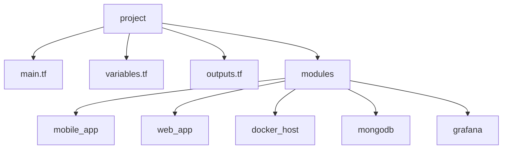
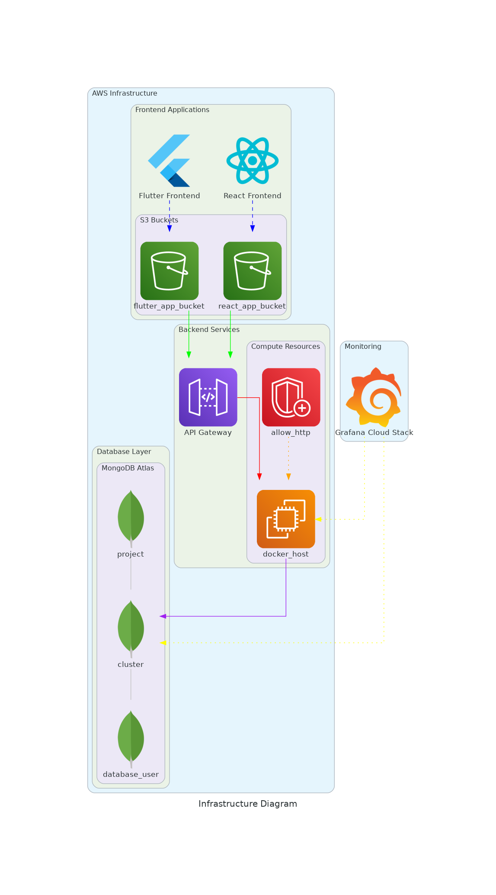

# Terraform Infrastructure as Code for Multi-Component Application

Este proyecto utiliza Terraform para desplegar una infraestructura escalable en AWS que soporta una aplicación con componentes móviles (Flutter), web (React) y un backend API.

## Estructura del Proyecto

## Componentes

- **Aplicación Móvil (Flutter)**: Alojada en AWS S3.
- **Aplicación Web (React)**: Alojada en AWS S3.
- **Backend API**: Desplegada en instancias EC2 con Docker.
- **Base de Datos**: MongoDB Atlas.
- **Monitoreo**: Grafana Cloud.

## Variables Principales

### Globales
- `environment`: Entorno de despliegue.
- `ec2_key_name`: Nombre de la clave EC2 para acceso SSH.

### Aplicación Móvil (Flutter)
- `flutter_app_bucket_name`: Nombre del bucket S3 para la app Flutter.

### Aplicación Web (React)
- `react_app_bucket_name`: Nombre del bucket S3 para la app React.

### Backend API
- `backend_images`: Lista de imágenes Docker para el backend.

### MongoDB Atlas
- `mongodb_atlas_org_id`: ID de la organización en MongoDB Atlas.
- `mongodb_project_name`: Nombre del proyecto en MongoDB Atlas.
- `mongodb_cluster_name`: Nombre del cluster de MongoDB.
- `mongodb_region`: Región para el cluster de MongoDB.

### Grafana
- `grafana_cloud_api_key`: API Key para Grafana Cloud.

## Uso

1. Asegúrate de tener Terraform instalado y configurado para trabajar con AWS.
2. Clona este repositorio.
3. Navega al directorio del proyecto.
4. Inicializa Terraform: 
terraform init
text
5. Revisa el plan de ejecución:

terraform plan
text
6. Aplica la configuración:

terraform apply
text

## Notas Importantes

- Asegúrate de tener los permisos necesarios en tu cuenta de AWS.
- Revisa y ajusta las variables en `variables.tf` según tus necesidades específicas.
- Considera usar un backend remoto para el estado de Terraform para facilitar la colaboración.

## Contribuciones

Las contribuciones son bienvenidas. Por favor, abre un issue o un pull request para sugerir cambios o mejoras.

## Diagrama

https://github.com/UPT-FAING-EPIS/proyecto-si8811a-2024-ii-u1-automatizado-huallpa_apaza/tree/DesarrolloApiBack

## Licencia

[MIT](https://choosealicense.com/licenses/mit/)
