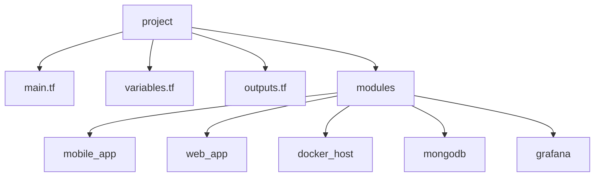

# Proyecto: Infraestructura Escalable para Aplicaciones Multi-Componente

[](https://classroom.github.com/open-in-codespaces?assignment_repo_id=17375597)
[](https://classroom.github.com/a/vK6WBQ1t)

Este proyecto utiliza **Terraform** para desplegar una infraestructura escalable en **AWS**, soportando aplicaciones móviles (**Flutter**), aplicaciones web (**React**) y una API backend. Además, implementa monitoreo continuo con **Grafana Cloud**.

---

## 📌 Contexto del Proyecto

El objetivo es crear y desplegar una infraestructura que automatice la configuración de recursos en la nube para aplicaciones modernas, garantizando seguridad, eficiencia y monitoreo en tiempo real.

Este trabajo se desarrolla dentro del marco de los Juegos Florales de la **UPT**, destacando la innovación en soluciones tecnológicas.

---

## 🎯 Objetivo Principal

Desplegar una infraestructura con **Terraform** para automatizar la creación y configuración de los siguientes componentes:

- **Aplicación Móvil (Flutter)**: Alojada en AWS S3.
- **Aplicación Web (React)**: Alojada en AWS S3.
- **Backend API**: Desplegada en instancias EC2 con Docker.
- **Base de Datos**: MongoDB Atlas.
- **Monitoreo**: Grafana Cloud.

---

## 🗂️ Estructura del Proyecto



---

## 🚀 Tecnologías Usadas

- **Terraform**: Gestión de infraestructura como código.
- **AWS**: Despliegue y administración de recursos.
- **MongoDB Atlas**: Base de datos en la nube.
- **Grafana Cloud**: Monitoreo y visualización de métricas.
- **Docker**: Contenedores ligeros para el backend.

---

## 🔑 Variables Principales

### Globales

- `environment`: Entorno de despliegue.
- `ec2_key_name`: Nombre de la clave EC2 para acceso SSH.

### Aplicación Móvil (Flutter)

- `flutter_app_bucket_name`: Nombre del bucket S3.

### Aplicación Web (React)

- `react_app_bucket_name`: Nombre del bucket S3.

### Backend API

- `backend_images`: Lista de imágenes Docker para el backend.

### MongoDB Atlas

- `mongodb_atlas_org_id`: ID de la organización.
- `mongodb_project_name`: Nombre del proyecto.
- `mongodb_cluster_name`: Nombre del cluster.
- `mongodb_region`: Región del cluster.

### Grafana

- `grafana_cloud_api_key`: API Key para Grafana Cloud.

---

## 🛠️ Uso

1. Instala y configura Terraform.
2. Clona este repositorio.
3. Navega al directorio del proyecto.
4. Inicializa Terraform:

   ```bash
   terraform init
   ```

5. Revisa el plan de ejecución:

   ```bash
   terraform plan
   ```

6. Aplica la configuración:

   ```bash
   terraform apply
   ```

---

## 🔎 Notas Importantes

- Verifica los permisos en tu cuenta de AWS.
- Ajusta las variables en `variables.tf` según tus necesidades.
- Considera usar un backend remoto para el estado de Terraform.

---

## 🖼️ Diagrama


---

## 🤝 Contribuciones

Las contribuciones son bienvenidas. Si deseas colaborar, abre un **issue** o un **pull request** con tus sugerencias.

---

## 📄 Licencia

Este proyecto está licenciado bajo la [MIT License](https://choosealicense.com/licenses/mit/).

---

💬 **Contacto:**  
📧 [aa2021071075@virtual.upt.pe](mailto:aa2021071075@virtual.upt.pe)  
🌍 [Repositorio en GitHub](https://github.com/UPT-FAING-EPIS/proyecto-si8811a-2024-ii-u1-desarrollo-api-back)  
